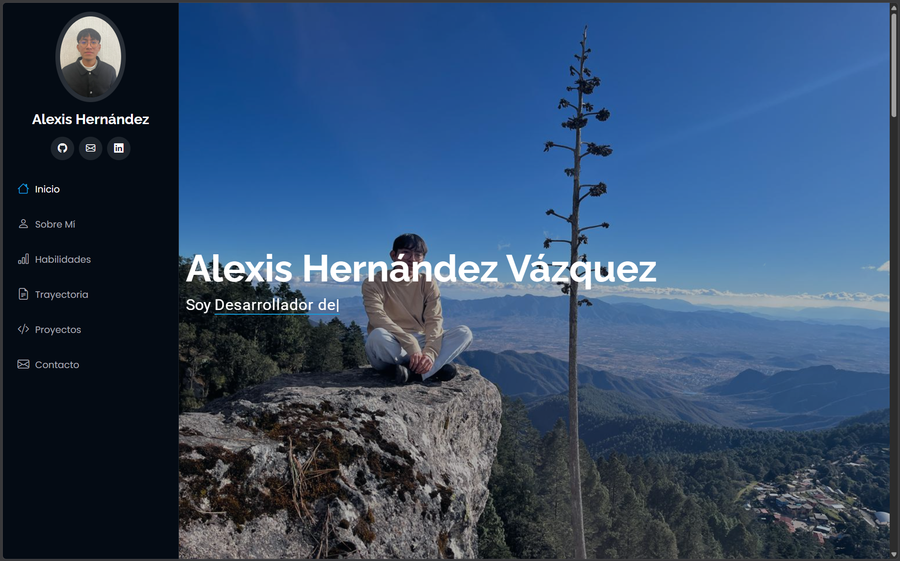
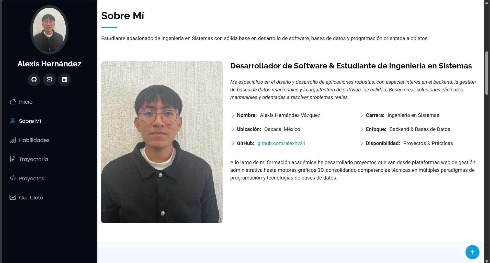
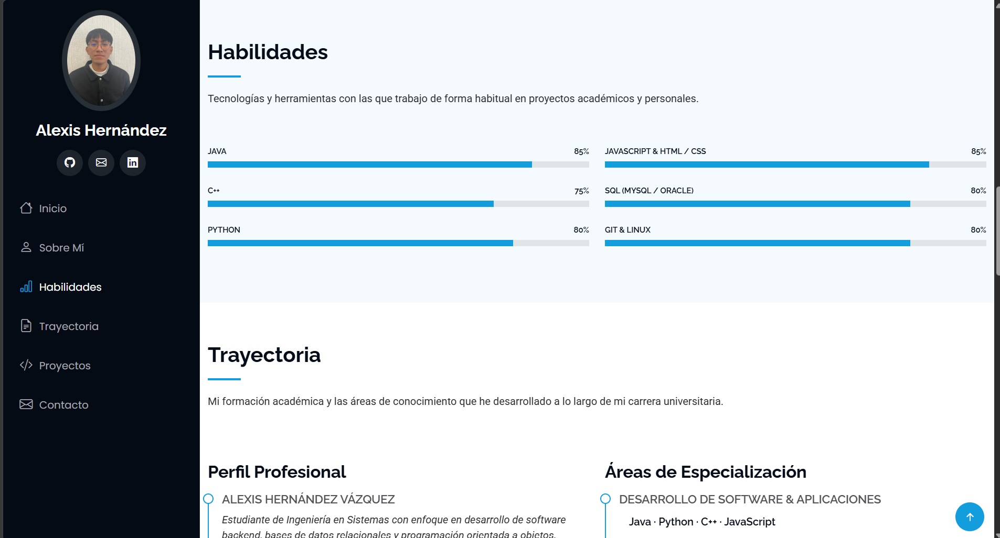
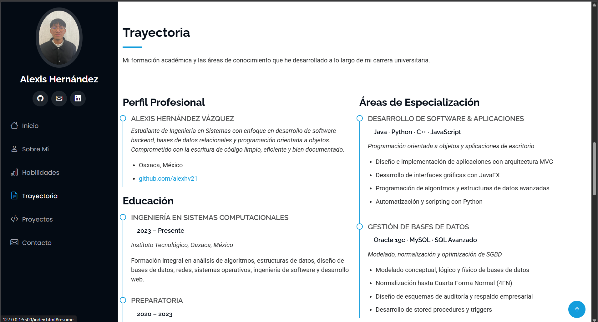
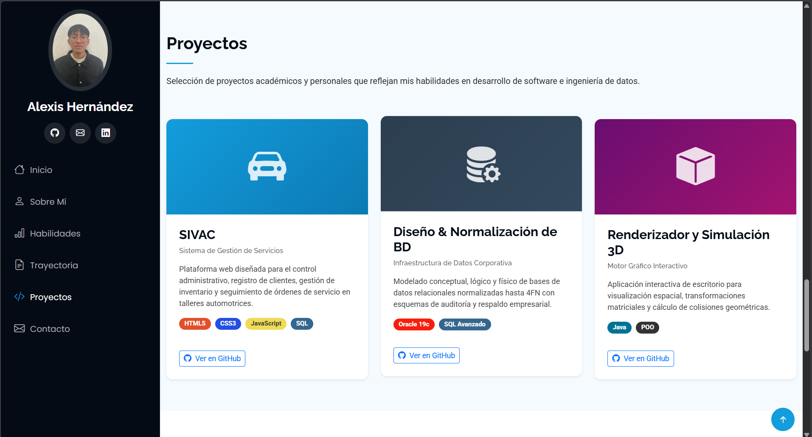
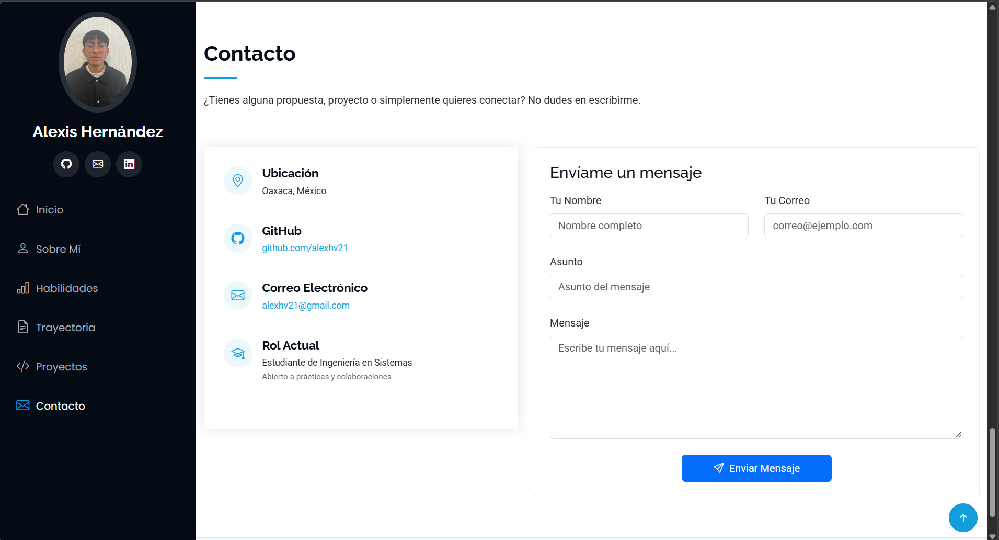

# Portafolio Personal

## Alexis Hernández Vázquez


---

### Instituto Tecnológico Nacional de México - Instituto Tecnológico de Oaxaca

| Campo             | Detalle                                  |
|-------------------|------------------------------------------|
| **Carrera**       | Ingeniería en Sistemas Computacionales   |
| **Materia**       | Programación Web - Unidad 2              |
| **Docente**       | Adelina Martínez Nieto                   |
| **Alumno**        | Hernández Vázquez Alexis                 |
| **Hora**          | 10:00 - 11:00                            |
| **Fecha de entrega** | 30 de septiembre del 2026             |

[](https://github.com/alexhv21)
[]()

---

## Descripción del Proyecto

Este es un portafolio personal construido con **HTML5**, **CSS3** y **JavaScript**, utilizando **Bootstrap 5.3.3** como framework CSS base. La plantilla utilizada es **iPortfolio**, descargada desde el siguiente enlace:

 [Descargar plantilla iPortfolio](https://bootstrapmade.com/iportfolio-bootstrap-portfolio-websites-template/)

---

## Secciones del Portafolio

El portafolio está compuesto por las siguientes secciones:

### Inicio (Hero)
Página principal con presentación personal, foto de fondo y texto animado con Typed.js. Incluye navegación lateral con foto de perfil.



### Sobre Mí
Fotografía de perfil, descripción profesional, datos personales y un resumen de la trayectoria académica.



### Habilidades
Barras de progreso animadas con las tecnologías y herramientas que domino.



### Trayectoria
Línea de tiempo con perfil profesional, educación y áreas de especialización.



### Proyectos
Tarjetas interactivas con los proyectos académicos desarrollados, incluyendo badges de tecnología.



### Contacto
Datos de ubicación, GitHub, correo electrónico y formulario de contacto funcional.



---

## Estructura del Repositorio

```
Actividad 4/
├── README.md               # Documentación del proyecto
├── index.html              # Página principal
├── css/
│   └── portafolio.css      # Estilos personalizados (Bootstrap + propios)
├── js/
│   └── portafolio.js       # Funcionalidad JavaScript
└── img/
    ├── perfil.jpg           # Foto de perfil
    ├── hero-bg.jpg          # Imagen de fondo del Hero
    ├── favicon.png          # Ícono del navegador
    └── apple-touch-icon.png # Ícono para dispositivos Apple
```

---

## Proceso de Creación

### Paso 1: Descarga de la Plantilla

Se descargó la plantilla **iPortfolio** desde [BootstrapMade](https://bootstrapmade.com/iportfolio-bootstrap-portfolio-websites-template/). Esta plantilla está construida con Bootstrap 5 e incluye un diseño moderno y responsive con navegación lateral.

### Paso 2: Análisis de la Estructura Original

La plantilla original venía con una estructura de carpetas para desarrollo (`assets/css/`, `assets/js/`, `assets/vendor/`, `assets/img/`). Esta estructura no se ajustaba a la que hemos venido utilizando en la materia.

### Paso 3: Cambio de Estructura

Decidí modificar la estructura original del proyecto para trabajar con la estructura que ya estoy familiarizado: una carpeta `css/` para estilos, una carpeta `js/` para JavaScript, una carpeta `img/` para imágenes, y el archivo `index.html` como página principal. Esta estructura es más sencilla, directa y fácil de entender.

Cambios realizados:

- Se renombró `assets/css/main.css` a `portafolio.css`
- Se renombró `assets/js/main.js` a `portafolio.js`
- Se movieron las imágenes de `assets/img/` a `img/`
- Se eliminó la carpeta `assets/vendor/` (reemplazada por CDN)
- Se eliminaron archivos innecesarios (`portfolio-details.html`, `service-details.html`, `starter-page.html`, etc.)

### Paso 4: Personalización del Contenido

Se modificó el contenido de la página para reflejar mi información personal:

- Se reemplazó el nombre genérico por mi nombre real
- Se actualizaron las secciones de habilidades con tecnologías que conozco y estoy aprendiendo
- Se agregaron mis proyectos reales académicos
- Se actualizó la información de educación y experiencia
- Se tradujo la navegación y el contenido al español

**Código — Sección Hero (nombre y texto animado):**

```html
<section id="hero" class="hero section dark-background">
  
  <div class="container" data-aos="fade-up" data-aos-delay="100">
    <h2>Alexis Hernández Vázquez</h2>
    <p>Soy <span class="typed"
      data-typed-items="Desarrollador de Software,Estudiante de Ingeniería en Sistemas,Entusiasta de Bases de Datos &amp; Backend">
    </span></p>
  </div>
</section>
```

**Código — Sidebar con nombre y foto de perfil:**

```html
<header id="header" class="header dark-background d-flex flex-column">
  <div class="profile-img">
    
  </div>
  <a href="index.html" class="logo d-flex align-items-center justify-content-center">
    <h1 class="sitename">Alexis Hernández</h1>
  </a>
  <div class="social-links text-center">
    <a href="https://github.com/alexhv21" target="_blank" class="github">
      <i class="bi bi-github"></i>
    </a>
  </div>
</header>
```

**Código — Sección Sobre Mí (datos personales):**

```html
<div class="row">
  <div class="col-lg-6">
    <ul>
      <li><i class="bi bi-chevron-right"></i> <strong>Nombre:</strong>
        <span>Alexis Hernández Vázquez</span></li>
      <li><i class="bi bi-chevron-right"></i> <strong>Ubicación:</strong>
        <span>Oaxaca, México</span></li>
      <li><i class="bi bi-chevron-right"></i> <strong>GitHub:</strong>
        <span><a href="https://github.com/alexhv21">github.com/alexhv21</a></span></li>
    </ul>
  </div>
  <div class="col-lg-6">
    <ul>
      <li><i class="bi bi-chevron-right"></i> <strong>Carrera:</strong>
        <span>Ingeniería en Sistemas</span></li>
      <li><i class="bi bi-chevron-right"></i> <strong>Enfoque:</strong>
        <span>Backend &amp; Bases de Datos</span></li>
      <li><i class="bi bi-chevron-right"></i> <strong>Disponibilidad:</strong>
        <span>Proyectos &amp; Prácticas</span></li>
    </ul>
  </div>
</div>
```

### Paso 5: Ajustes Técnicos

- Se corrigieron todas las rutas de archivos CSS, JavaScript e imágenes
- Se actualizó el copyright y textos en español
- Se migraron todas las dependencias de terceros a CDN (Bootstrap, AOS, Typed.js, GLightbox, Swiper, Isotope, PureCounter, Waypoints)

**Código — Dependencias CDN en el `<head>`:**

```html
<!-- Vendor CSS (CDN) -->
<link href="https://cdn.jsdelivr.net/npm/bootstrap@5.3.3/dist/css/bootstrap.min.css" rel="stylesheet">
<link href="https://cdn.jsdelivr.net/npm/bootstrap-icons@1.11.3/font/bootstrap-icons.min.css" rel="stylesheet">
<link href="https://cdn.jsdelivr.net/npm/aos@2.3.4/dist/aos.css" rel="stylesheet">
<link href="https://cdn.jsdelivr.net/npm/glightbox/dist/css/glightbox.min.css" rel="stylesheet">
<link href="https://cdn.jsdelivr.net/npm/swiper@11/swiper-bundle.min.css" rel="stylesheet">

<!-- Hoja de estilos personalizada -->
<link href="css/portafolio.css" rel="stylesheet">
```

### Paso 6: Personalización de Habilidades

Las habilidades se configuraron con barras de progreso animadas:

- **Java** (85%) · **C++** (75%) · **Python** (80%)
- **JavaScript & HTML/CSS** (85%) · **SQL (MySQL / Oracle)** (80%) · **Git & Linux** (80%)

**Código — Ejemplo de barra de progreso:**

```html
<div class="progress">
  <span class="skill"><span>Java</span> <i class="val">85%</i></span>
  <div class="progress-bar-wrap">
    <div class="progress-bar" role="progressbar" aria-valuenow="85"
         aria-valuemin="0" aria-valuemax="100"></div>
  </div>
</div>
```

### Paso 7: Documentación

Se creó este archivo README con toda la información requerida, incluyendo la descripción del proyecto, el proceso de creación y los links de referencia.

---

## Tecnologías Utilizadas

- **HTML5** — Estructura y semántica del sitio
- **CSS3** — Estilos personalizados y diseño responsive
- **JavaScript** — Interactividad, animaciones y lógica del sitio
- **Bootstrap 5.3.3** — Framework CSS para layout y componentes
- **AOS** — Animaciones al hacer scroll
- **Typed.js** — Texto animado en la sección Hero
- **GLightbox** — Lightbox para imágenes
- **Swiper** — Slider de contenido
- **PureCounter** — Contadores animados

---

## Habilidades

### Tecnologías que domino

- HTML5, CSS3, JavaScript
- Java
- C++
- Python
- SQL (MySQL / Oracle)
- Git & Linux

---

## Proyectos

### 1. SIVAC — Sistema de Gestión de Servicios

Plataforma web diseñada para el control administrativo, registro de clientes, gestión de inventario y seguimiento de órdenes de servicio en talleres automotrices.

**Tech Stack:** HTML5, CSS3, JavaScript, SQL

### 2. Diseño & Normalización de BD Corporativa

Modelado conceptual, lógico y físico de bases de datos relacionales normalizadas hasta 4FN con esquemas de auditoría y respaldo empresarial.

**Tech Stack:** Oracle 19c, SQL Avanzado

### 3. Renderizador y Simulación 3D

Aplicación interactiva de escritorio para visualización espacial, transformaciones matriciales y cálculo de colisiones geométricas.

**Tech Stack:** Java, POO

---

## Cómo Ejecutar

1. Clonar el repositorio:

   ```bash
   git clone 
   ```

2. Abrir `index.html` en un navegador web.

> Requiere conexión a internet para cargar las dependencias CDN (Bootstrap, iconos, animaciones).

---

## GitHub Pages

[Ver portafolio en vivo]()
